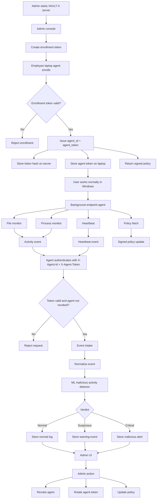

# VAULT-X Enterprise DLP Implementation Report

> Canonical architecture: `docs/CANONICAL_SYSTEM_FLOW.md`. The flow in that
> document is authoritative. Current implementation gaps, including real HSM,
> five-layer encryption, database proxying, and rate limiting, must be completed
> before describing the full diagram as production-ready.

## 1. Project Status

VAULT-X has been evolved from a personal encrypted vault into a prototype enterprise DLP and endpoint monitoring platform.

The current system has two major sides:

```text
Admin Side
  Admin server
  Admin browser console
  Enterprise state store
  Policy management
  Agent enrollment and revocation
  ML/risk detection
  Event and audit view

Employee Laptop Side
  Background endpoint agent
  Normal Windows user activity
  File/process activity monitoring
  Heartbeats
  Policy fetch
  Event reporting
```

The employee does not need to use a VAULT-X UI. They use Windows normally. The endpoint agent runs in the background and reports approved security metadata to the admin server.

## 2. Main Goal

The goal is to create an organization-controlled DLP platform where:

1. Admins control the server and UI.
2. Each employee laptop enrolls as a managed endpoint.
3. Each laptop receives its own identity and token.
4. Each laptop reports activity and suspicious behavior.
5. The server scores events using the malicious activity detector.
6. The admin UI shows normal logs, suspicious activity, malicious triggers, and ML reasons.

## 3. What Was Built

## 3.1 Admin HTTP Server

File:

```text
server/vault_server.py
```

Purpose:

```text
Runs the HTTP API and browser admin console.
Protects admin APIs with the admin bearer key.
Protects laptop agent APIs with per-agent credentials.
Serves the admin UI at http://127.0.0.1:8765/
```

Important endpoints:

```text
GET  /health
GET  /
GET  /v1/status
GET  /v1/enterprise/summary
GET  /v1/agents
GET  /v1/events
GET  /v1/policies
POST /v1/policies/default
POST /v1/enrollment-token/rotate
POST /v1/agents/register
POST /v1/agents/:agent_id/heartbeat
GET  /v1/agent/policy
POST /v1/events
POST /v1/detect
POST /v1/agents/:agent_id/revoke
POST /v1/agents/:agent_id/restore
POST /v1/agents/:agent_id/rotate-token
```

## 3.2 Enterprise State Store

File:

```text
server/enterprise_store.py
```

Purpose:

```text
Stores managed laptop agents.
Stores enrollment token.
Stores agent token hashes.
Stores DLP policies.
Stores endpoint events.
Stores ML detection results.
Supports agent revocation and token rotation.
Signs policy payloads.
```

Storage:

```text
my_vault/enterprise_state.json
```

Important security improvement:

```text
The server does not store raw agent tokens.
It stores only SHA-256 hashes of agent tokens.
```

## 3.3 Endpoint Agent

File:

```text
agent/vaultx_agent.py
```

Purpose:

```text
Runs on each employee laptop.
Enrolls the laptop.
Stores agent_id and agent_token locally.
Sends heartbeat.
Fetches signed policy.
Reports endpoint events.
Can run a continuous monitor.
```

Commands:

```powershell
python -m agent.vaultx_agent enroll
python -m agent.vaultx_agent heartbeat
python -m agent.vaultx_agent policy
python -m agent.vaultx_agent event
python -m agent.vaultx_agent monitor
python -m agent.vaultx_agent scan-once
```

## 3.4 Endpoint Activity Monitor

File:

```text
agent/activity_monitor.py
```

Purpose:

```text
Watches normal Windows user activity.
Detects file creation, modification, movement, deletion.
Detects sensitive file names/extensions.
Detects suspicious script/binary activity.
Detects suspicious Windows processes.
Reports metadata to the admin server.
```

It does not upload file contents. It reports metadata such as:

```text
file name
extension
file size
action
path hash
process name
rule name
timestamp
```

## 3.5 AI/ML Malicious Activity Detector

File:

```text
server/ml_detector.py
```

Purpose:

```text
Scores endpoint events.
Detects suspicious/malicious behavior.
Adds ML verdict, score, features, and reasons.
Upgrades event severity when needed.
```

Verdicts:

```text
normal
suspicious
high
critical
```

Example critical case:

```text
PowerShell uploads a sensitive finance file to an unknown external domain.
```

Example result:

```text
ML verdict: critical
Score: 86%
Reasons:
  Suspicious process observed
  Sensitive file type involved
  External upload behavior
```

## 3.6 Admin Console UI

File:

```text
server/vault_server.py
```

The admin UI is served directly from the server.

URL:

```text
http://127.0.0.1:8765/
```

It shows:

```text
Managed laptops
Online/offline state
Revoked laptop count
Security event count
DLP policies
Recent activity events
ML verdicts and scores
ML reasons
Agent token preview
```

## 4. Security Model

## 4.1 Old Model

Earlier, the same admin API key could be used by agents.

That is not ideal because if one laptop gets compromised, the admin API key could be exposed.

## 4.2 New Model

The new model separates admin access from laptop access.

```text
Admin Browser
  Uses admin bearer key.

Employee Laptop Agent
  Uses unique agent_id and unique agent_token.

Server
  Stores only token hash.
```

Agent requests now use:

```text
X-Agent-Id: <agent_id>
X-Agent-Token: <agent_token>
```

Admin requests use:

```text
Authorization: Bearer <VAULTX_API_KEY>
```

## 5. Step-By-Step Working Flow

## 5.1 Admin Starts Server

Admin sets an API key:

```powershell
$env:VAULTX_API_KEY = "vaultx-local-dev-key"
```

Admin starts the server:

```powershell
python vaultx.py serve --host 127.0.0.1 --port 8765
```

Then opens:

```text
http://127.0.0.1:8765/
```

## 5.2 Admin Creates Enrollment Token

Admin rotates or creates an enrollment token:

```text
POST /v1/enrollment-token/rotate
```

This token is used only for first-time laptop enrollment.

## 5.3 Laptop Agent Enrolls

On the employee laptop:

```powershell
$env:VAULTX_ENROLLMENT_TOKEN = "<enrollment-token>"
python -m agent.vaultx_agent enroll --server http://ADMIN_SERVER:8765 --user employee.name --department Finance
```

The laptop sends:

```text
hostname
assigned user
department
OS version
agent version
heartbeat data
enrollment token
```

## 5.4 Server Validates Enrollment

Server checks:

```text
Is enrollment token valid?
```

If no:

```text
Enrollment denied.
```

If yes:

```text
Server creates agent_id.
Server creates unique agent_token.
Server stores only hash of agent_token.
Server assigns policy.
Server returns signed policy.
```

## 5.5 Agent Stores Credentials

Agent stores locally:

```text
agent_id
agent_token
policy_id
signed_policy
```

After this, the laptop does not need the admin API key.

## 5.6 User Works Normally

The employee uses Windows normally:

```text
opens files
edits documents
copies files
runs applications
uses browser/network
```

The VAULT-X UI is not shown to the employee.

## 5.7 Agent Runs In Background

Agent can run:

```powershell
python -m agent.vaultx_agent monitor --watch-root "$env:USERPROFILE\Documents"
```

The monitor checks:

```text
file activity
process activity
sensitive extensions
sensitive names
suspicious scripts/binaries
heartbeat status
policy updates
```

## 5.8 Agent Sends Events

Agent sends events using:

```text
X-Agent-Id
X-Agent-Token
```

Example event:

```json
{
  "type": "large_external_upload",
  "severity": "info",
  "details": {
    "process": "powershell",
    "destination": "https://unknown-upload.example",
    "upload_mb": 250,
    "path": "finance_secret.xlsx",
    "rule": "large upload of sensitive file"
  }
}
```

## 5.9 Server Authenticates Agent

Server checks:

```text
Does agent_id exist?
Is agent revoked?
Does token hash match?
```

If invalid:

```text
Request rejected with 401.
```

If valid:

```text
Event is accepted.
```

## 5.10 Server Runs ML Detection

The event is passed to:

```text
server/ml_detector.py
```

The detector extracts features:

```text
suspicious process
sensitive extension
external destination
large upload
many file changes
malicious keywords
policy violation
after-hours flag
```

Then returns:

```text
score
verdict
reasons
features
model name
```

## 5.11 Admin Sees Logs

Admin console displays:

```text
normal activity
suspicious activity
critical malicious activity
ML score
ML reasons
device name
assigned user
department
policy
online/offline state
```

## 6. Updated Architecture Diagram



## 7. Files Created Or Updated

```text
server/vault_server.py
server/enterprise_store.py
server/ml_detector.py
agent/vaultx_agent.py
agent/activity_monitor.py
docs/ENTERPRISE_DLP_PLAN.md
docs/UPDATED_ENTERPRISE_FLOW.md
ENTERPRISE_DLP_IMPLEMENTATION_REPORT.md
```

## 8. What Was Verified

The following checks were performed:

```text
Python syntax checks passed.
Server starts successfully.
Admin summary endpoint works.
Fresh laptop enrollment works without admin API key.
Agent heartbeat works using only agent token.
Agent policy fetch works using only agent token.
Agent event reporting works using only agent token.
Fake agent token returns 401.
Admin UI loads successfully.
```

## 9. Current Limitations

This is still a prototype. Important future improvements:

```text
Replace JSON store with SQLite/PostgreSQL.
Add real admin login instead of API key field.
Run endpoint agent as a Windows service.
Add tamper detection if user stops the agent.
Add per-agent and per-department policies.
Add real network destination monitoring.
Use asymmetric Ed25519 policy signatures instead of HMAC.
Add alert lifecycle: new, investigating, resolved, false positive.
Add TLS/mTLS for production deployment.
```

## 10. Best Next Step

The next best improvement is:

```text
Windows service installer for the endpoint agent.
```

That will make the employee laptop side behave like real enterprise software:

```text
installed once by admin
starts automatically on boot
runs in background
sends heartbeat
sends activity events
receives policy updates
alerts admin if stopped
```
