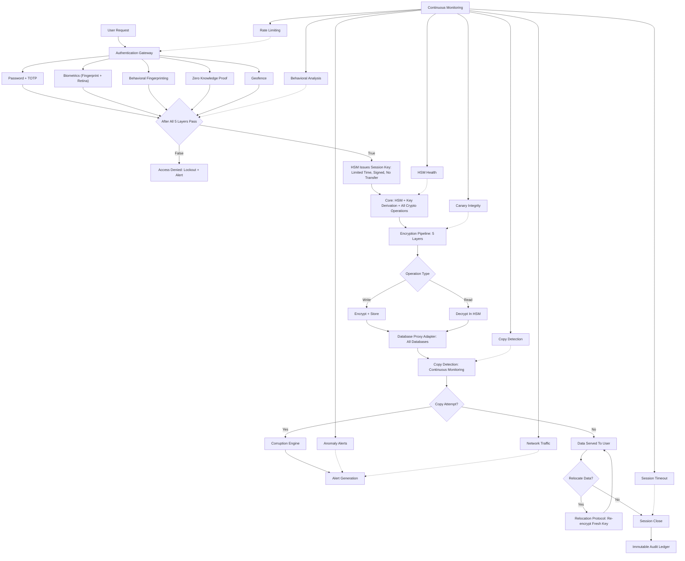

# VAULT-X Canonical System Flow

This document is the single canonical architecture for VAULT-X. Product features
and implementation work should follow this sequence.

## Implementation Status

| Flow block | Current status |
|---|---|
| Authentication gateway | Implemented |
| Password + TOTP | Implemented |
| Biometrics | Placeholder/passphrase adapter; real hardware integration required |
| Behavioral fingerprinting | Prototype implemented |
| Zero knowledge proof | Simplified local challenge-response implemented |
| Geofence/device check | Prototype implemented |
| All-five pass gate | Implemented |
| Lockout and alert | Implemented |
| HSM session key | Simulated in software; real HSM integration required |
| Core key derivation/crypto | Implemented in software |
| Five-layer encryption | Not implemented; current pipeline is canary + ChaCha20-Poly1305 + AES-GCM |
| Encrypt/store and decrypt | Implemented |
| Database proxy adapter | Not implemented |
| Continuous copy detection | Implemented for protected filesystem paths |
| Corruption engine | Prototype implemented in daemon response logic |
| Alert generation | Implemented through events/admin console |
| Data served to user | Implemented for vault operations |
| Relocation with fresh key | Implemented |
| Session close/timeout | Implemented |
| Immutable audit ledger | Implemented as append-only hash chain |
| Network traffic monitoring | Partial metadata/event support; real sensor required |
| HSM health monitoring | Not implemented until a real HSM is integrated |
| Rate limiting | Not implemented |

## Rule For Future Changes

New features should attach to one of the blocks above. The endpoint-agent and
admin-console components are operational surfaces around this canonical backend
flow; they do not replace or reorder its security stages.

