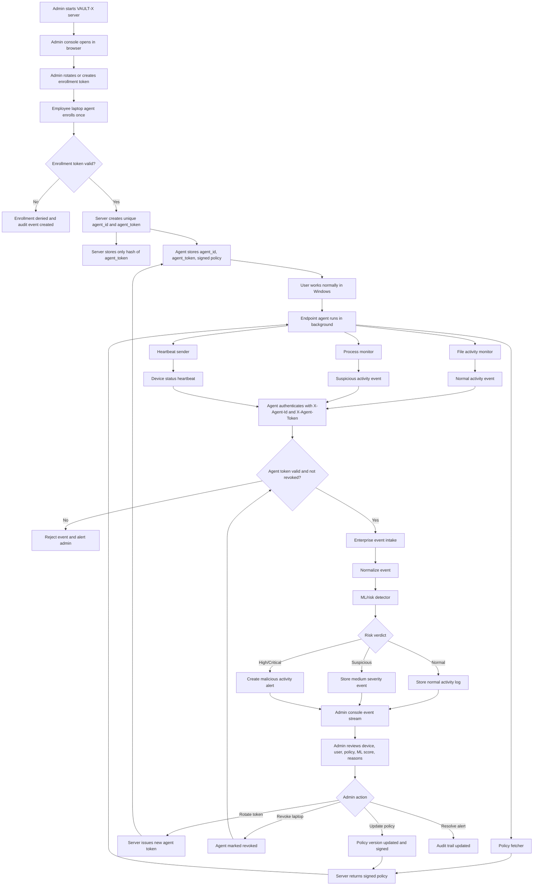

# VAULT-X Updated Enterprise Flow

> This document explains enterprise deployment and agent communication. The
> authoritative backend security sequence is `docs/CANONICAL_SYSTEM_FLOW.md`.
> If the two appear to conflict, the canonical system flow takes precedence.

## Current Working Model

VAULT-X is now designed as an admin-managed endpoint DLP platform.

Employees do not use the VAULT-X UI. They work normally on Windows. The laptop
agent runs in the background, collects approved security metadata, enforces or
reports policy decisions, and sends telemetry to the admin server.

## Full Flow Diagram



## Trust Boundaries

```text
Admin Browser
  Uses admin bearer API key.
  Can view agents, rotate enrollment token, revoke agents, update policies.

Endpoint Agent
  Uses its own agent_id and agent_token.
  Never needs the admin API key after the new flow.

Server
  Stores only hashes of agent tokens.
  Signs policy payloads.
  Scores events with the ML detector.

Employee
  Uses Windows normally.
  Does not need to open or operate VAULT-X.
```

## Authentication Flow

```text
1. Admin creates enrollment token.
2. Agent sends enrollment token and laptop metadata.
3. Server validates enrollment token.
4. Server creates:
   - agent_id
   - agent_token
   - token hash
   - assigned policy
5. Server returns agent_id, agent_token, and signed policy.
6. Agent stores credentials locally.
7. Future agent calls use:
   - X-Agent-Id
   - X-Agent-Token
```

## Event Flow

```text
1. User edits/copies/runs files normally.
2. Agent detects activity.
3. Agent sends event metadata.
4. Server authenticates agent token.
5. Server normalizes event.
6. ML detector scores the event.
7. Server stores:
   - raw event
   - severity
   - ML verdict
   - score
   - reasons
8. Admin UI shows the event.
```

## Admin Controls

```text
Rotate enrollment token
Revoke laptop agent
Restore laptop agent
Rotate laptop agent token
Update DLP policy
Review ML alert reasons
View fleet online/offline state
```

## Current Implementation Files

```text
server/vault_server.py        Admin/API server
server/enterprise_store.py    Agents, tokens, policies, events
server/ml_detector.py         Malicious activity detector
agent/vaultx_agent.py         Endpoint agent CLI/client
agent/activity_monitor.py     Windows activity monitor
```
